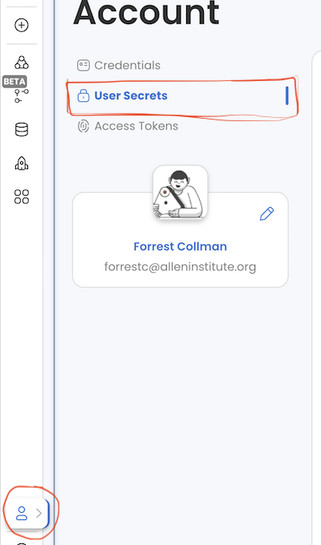
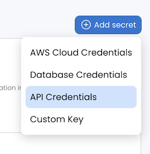
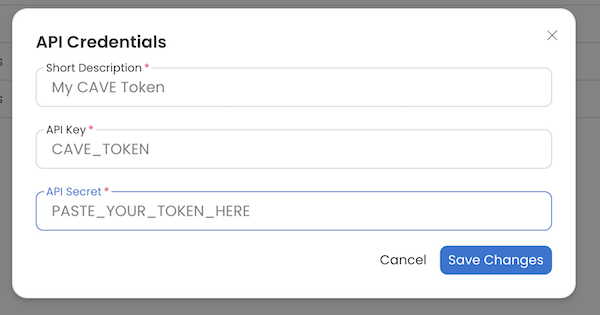
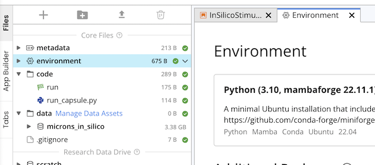
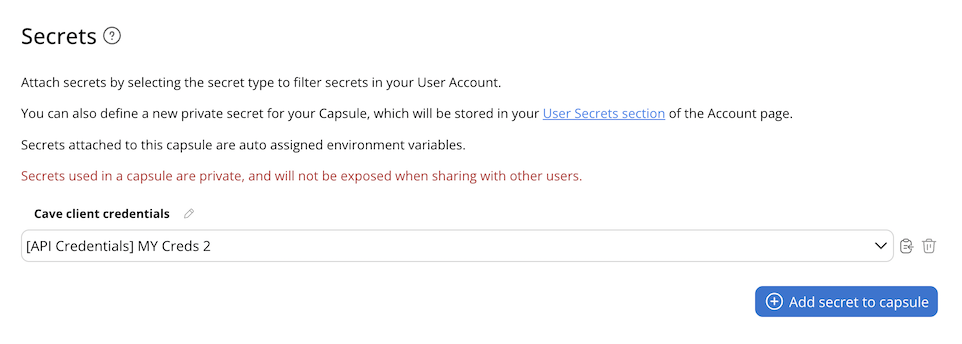

# CAVE Setup

## !!! RUN THIS ONCE PER COMPUTER YOU ARE SETTING UP !!!

The Connectome Annotation Versioning Engine (CAVE) supports several large scale EM datasets, and has an authentication system that regulates access to the webservices and datasets. In order to connect to the servers you have to authenticate to tell the server who you are.  

When accessing the servers programatically this is done by passing a token that validates who you are.
The server has a copy of this token, it's like a password, but the server makes it for you.

You can tell the server to make a new token for you.

You can tell the server to list the token it has for you.

The token is a string of letters and numbers like "ecc4casd1f70f254dwad452524bd0d0d8" (but that one is made up)

If you are using codeocean, you need to setup a secret with that token and configure your capsule to load that secret as an environment variable. 

If you are using your own computer you need to save this token to a file on your computer so that the caveclient can read it and pass it onto the server when interacting with it to tell it who you are.  You can't do this with codeocean because each time your run a capsule its a new computer.

The CAVEclient has methods that help you do all these things, but note you might want to do different things depending on what you are trying to do.  This notebook will break down those scenarios and you can follow the one most appropriate to what you are trying to do.

### Scenario 1: Completely new user

You have never interacted with CAVE before, you don't think you have an account, and have never setup a computer before with CAVE.

In this case you want to.
1. Login to CAVE to setup a new account. To do this go to this [website](https://minnie.microns-daf.com/materialize/views/datastack/minnie65_public).
   
3. Sign the terms of service associated with the MICRONS dataset. You should have been prompted to do it with step 1. But just to check go to this website <a href="https://global.daf-apis.com/sticky_auth/api/v1/tos/2/accept"> Microns Public TOS </a>.
   
2. Create a new token

    * Go to: [https://global.daf-apis.com/auth/api/v1/create_token](https://global.daf-apis.com/auth/api/v1/create_token) to create a new token.
    * Log in with your Google credentials and copy the token shown afterward.
       Note: If you need to save or load multiple tokens, please read the documentation for details.
   
4a. If codeocean (if not use step 4b): copy token into a api credential secret, and mount to capsule using the following steps
   
* Copy token to clipboard
* Got to User Settings on code ocean (<a href="https://codeocean.allenneuraldynamics.org/account" target="_blank">click this link</a> to open in a new tab so you can get back here to see instructions).

  This is where it is on your screen, but don't just click here because then you will not be able to see the instructions.

   
   
* Click on User Secrets
* Click on Add Secret>API Credentials in upper right

    
  
* Give your token a name, put "CAVE_TOKEN" for key and your token as value (no quotes)

   

* Click on environment in your capsule

    

* Scroll down to the secrets section and select your API credential

    
 

* Your CAVE token should now be available in your capsule as an environment variable "API_SECRET"

4b. If NOT code ocean computer: Save the token to a file on your computer so caveclient can read it using this caveclient command

```
    client=CAVEclient()
    # paste the token after token= in quotes as a string
    client.auth.save_token(token=, overwrite=True)

```

This will save a file at ```~/.cloudvolume/secrets/cave-secret.json``` and ```~/.cloudvolume/secrets/global.daf-apis.com-cave-secret.json``` with your token that CAVEclient will use every time it tries to access a CAVE server. The second file is server specific, and the location is the default server associated with the first and largest CAVE deployemnt.
